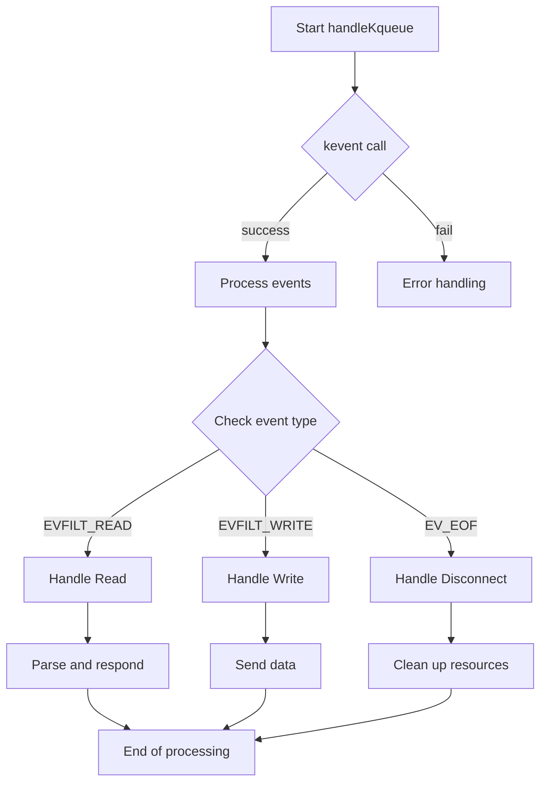
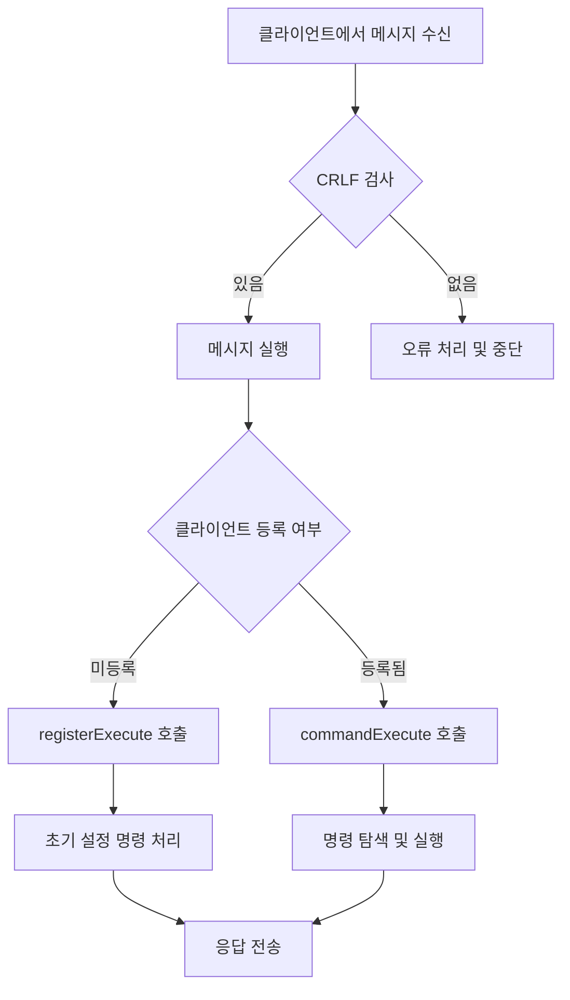

```mermaid
graph TD;
    A[Client Constructor] -->|initialize| B[setRecvFd]
    A -->|initialize| C[setPassword]
    A -->|initialize| D[setNick]
    A -->|initialize| E[setUsername]
    A -->|initialize| F[setHostname]
    A -->|initialize| G[setRealname]
    A -->|initialize| H[setRecvData]
    A -->|initialize| I[setSendMsg]
    A -->|initialize| J[setWriteTypes]
    A -->|initialize| K[setRegistered]
    A -->|initialize| L[setCurChannel]
    A -->|initialize| M[setRegisterFlags]
    A -->|initialize| N[setLeaveMsg]
    B --> O[getrecvfd]
    C --> P[getPassword]
    D --> Q[getNick]
    E --> R[getUser]
    F --> S[getHostname]
    G --> T[getRealname]
    H --> U[getRecvData]
    I --> V[getSendMsg]
    J --> W[getWriteTypes]
    K --> X[getRegisterd]
    L --> Y[getCurChannel]
    M --> Z[getIsRegisterFlags]
    N --> AA[getLeaveMsg]
    AB(startListen) --> AC[Accept Connection]
    AC --> F
    AC --> AD[Set Non-Blocking]
    AE(startParseMessage) --> AF[Parse Message]
    AF --> AG[Clear m_recv_data]
    AF --> AH[Execute Command]
    AI(startResponse) --> AJ[Generate Response]
    AK(startSend) --> AL[Send m_send_msg]
    AL --> AM[Clear m_send_msg]
    AN(addSendMsg) --> AO[Append to m_send_msg]
```

# FT_IRC

FT_IRC는 IRC(Internet Relay Chat) 서버 구현 프로젝트입니다. 이 프로젝트는 네트워크 프로그래밍의 기본을 학습하고, 실시간 텍스트 기반 통신 시스템을 구축하는 것을 목표로 합니다. FT_IRC는 사용자가 채널을 생성하고, 메시지를 교환하며, 다양한 IRC 명령어를 사용할 수 있는 환경을 제공합니다.

기술 스택
- 프로그래밍 언어: C++
- 네트워크 라이브러리: POSIX sockets
- 테스트 프레임워크: irssi, nc
- 기타 도구: Make, Docker, codespace

### 설치 및 실행 방법
1. 소스 코드 클론:
```bash
git clone https://github.com/ByteTalkers/FT_IRC.git
```
2. 컴파일
```bash
make -j
```
3. 서버 실행
``` bash
./ircserv <port> <password>
```
4. 클라이언트 연결 (별도의 IRC 클라이언트 사용 ex, irssi):
```bash
irssi
```

### 사용 예제
1. 서버에 연결
```bash
/connect -nocap <client_ip> <port> <password> <nick>
```
2. 채널 가입
```bash
/join <your_nickname>
```
3. 메시지 전송
```bash
/privmsg <channel_name> <message>
```
4. 채널 나가기
```bash
/part <channel_name>
```
5. 모드 기능
- i : invite 모드
- t : topic 모드
- k : key 모드
- o : operator 모드
- l : 채널 제한 인원 모드
모드 앞에 +가 붙으면 모드 활성화, -면 모드 비활성화
6. 토픽 설정
```bash
/topic <channel_name> <topic topics>
```
7. 강퇴 기능
```bash
/kick <channel_name> <target_client>
```
8. 종료 기능
```bash
/quit <reason>
```
### Server 함수 흐름도


### Client 함수 흐름도


### Message 함수 흐름도


## 소켓의 구조
1. 서버소켓 초기화
- `socket()` : 소켓을 생성하는 함수
- `setsocketopt()` : 소켓의 옵션을 조정하는 함수
	- 이전 소켓이 종료되었을 경우, 완전히 종료되었음을 확인하는 TIME_WAIT 상태가 발생
	- 이 상태에 있는 동안에는 같은 포트로 새 소켓을 이용할 수 없음.
	- 따라서 setsocketopt() 함수를 이용해 TIME_WAIT 상태를 최소화

- `bind()` : ip 주소와 port번호를 소켓에게 할당.
	- ip주소와 port번호를 설정하는 부분이 바로 serv_adr 구조체.
	- `.sin_family`: IPV4, IPV6 중 선택
	- `.sin_addr.s_addr` : ip주소 선택. INADDR_ANY 옵션 = localhost(=127.0.0.1)

- `listen()` : 연결요청 가능상태로 변경
- `fcntl()` : 논블로킹 처리

2. kqueue()
> 톡방(=서버)에 들어오는 사람 수가 많다면(= fd가 여러 개)? 여러 개의 요청을 받아야 한다.
- 여러개의 요청을 받는 방법 : 멀티프로세스, 멀티쓰레드. 그러나 이 두 해결책은 자원낭비가 너무 심하다. 
- 따라서, 이를 위해 하나의 프로세스(쓰레드)만으로 하는 방법 = 멀티플랙싱을 도입
- 대표적인 함수가 바로 `select()`이다.
- 특정한 방을 만들고, 여기에 모든 fd를 담아서 확인한다.

> 한 프로세스(쓰레드)면 느리지 않을까?
- 전체적인 서비스 제공시간이 늦어져도 모든 클라이언트에게 서비스를 제공하는 것이 낫다.
- cpu 연산과 관련 없는 데이터의 송수신 시간이 실제 전송시간에서는 큰 비중을 차지하므로, 이를 효율적으로 쓰기 위해서는 멀티플랙싱이 나음.

> 방에 등록된 모든 fd를 검사해야 할까?
- 이러한 의문에서 나온 것이 바로 kqueue()와 epoll()이다.
- select()로 연결을 받으면 매번 방에 담긴 모든 fd를 while()문으로 검사
- 반면, kqueue()와 epoll()은 연락이 온 fd만 검사한다.
	- 연락이라는 행동 = 이벤트로 정의.
- 유닉스에서는 kqueue(), 리눅스에서는 epoll()
	- macOS는 유닉스의 일종이므로 여기서는 kqueue()를 사용

> 그래서, kqueue()의 장점을 정리해보면,
1. 따라서, 이벤트 발생 시, 해당 이벤트에 접근하는 시간복잡도가 O(1)이다.
2. 등록된 이벤트를 따로 관리할 필요가 없다.

```c
kqueue(); // 이벤트를 담을 방(=kernel queue)을 정의
EV_SET(); // 어떤 이벤트를 받을지 정의하는 매크로 함수.
kevent(); // 이벤트를 넣고, 받은 이벤트를 넣는 함수.
```