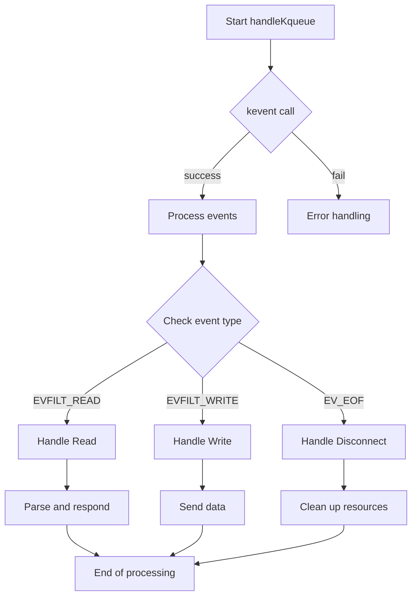
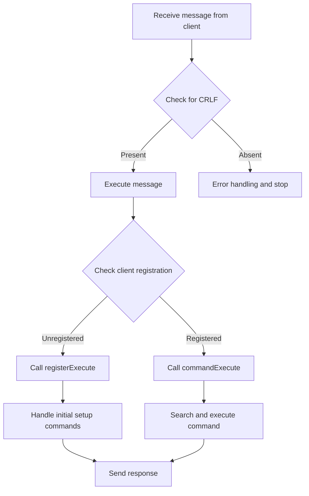

# FT_IRC

FT_IRC is a project that implements an IRC (Internet Relay Chat) server. The aim of this project is to learn the basics of network programming and to build a real-time text-based communication system. FT_IRC provides an environment where users can create channels, exchange messages, and use various IRC commands.


Technology Stack

- Programming Language: C++
- Network Library: POSIX sockets
- Testing Framework: irssi, nc
- Other Tools: Make, Docker, codespace


### Installation and Running Instructions

1. Clone the source code:
```bash
git clone https://github.com/ByteTalkers/FT_IRC.git
```
2. Compile:
```bash
make -j
```
3. Run the server
``` bash
./ircserv <port> <password>
```
4. Connect with a client (e.g., using irssi):
```bash
irssi
```

### Usage Examples
1. Connect to the server:
```bash
/connect -nocap <client_ip> <port> <password> <nick>
```
2. Join a channel:
```bash
/join <your_nickname>
```
3. Send a message:
```bash
/privmsg <channel_name> <message>
```
4. Leave a channel:
```bash
/part <channel_name>
```
5. Mode functions:
- i : invite mode
- t : topic mode
- k : key mode
- o : operator mode
- l : limit channel members mode
Prefix mode with + to enable, - to disable.
6. Set a topic:
```bash
/topic <channel_name> <topic topics>
```
7. Kick function:
```bash
/kick <channel_name> <target_client>
```
8. Quit function:
```bash
/quit <reason>
```
### Server Function Flowchart



### Client Function Flowchart

```mermaid
graph TD;
    A[Client Constructor] -->|initialize| B[setRecvFd]
    A -->|initialize| C[setPassword]
    A -->|initialize| D[setNick]
    A -->|initialize| E[setUsername]
    A -->|initialize| F[setHostname]
    A -->|initialize| G[setRealname]
    A -->|initialize| H[setRecvData]
    A -->|initialize| I[setSendMsg]
    A -->|initialize| J[setWriteTypes]
    A -->|initialize| K[setRegistered]
    A -->|initialize| L[setCurChannel]
    A -->|initialize| M[setRegisterFlags]
    A -->|initialize| N[setLeaveMsg]
    B --> O[getrecvfd]
    C --> P[getPassword]
    D --> Q[getNick]
    E --> R[getUser]
    F --> S[getHostname]
    G --> T[getRealname]
    H --> U[getRecvData]
    I --> V[getSendMsg]
    J --> W[getWriteTypes]
    K --> X[getRegisterd]
    L --> Y[getCurChannel]
    M --> Z[getIsRegisterFlags]
    N --> AA[getLeaveMsg]
    AB(startListen) --> AC[Accept Connection]
    AC --> F
    AC --> AD[Set Non-Blocking]
    AE(startParseMessage) --> AF[Parse Message]
    AF --> AG[Clear m_recv_data]
    AF --> AH[Execute Command]
    AI(startResponse) --> AJ[Generate Response]
    AK(startSend) --> AL[Send m_send_msg]
    AL --> AM[Clear m_send_msg]
    AN(addSendMsg) --> AO[Append to m_send_msg]
```


### Message Function Flowchart


## Socket Structure
1. Server Socket Initialization
- `socket()` :  Function to create a socket.
- `setsocketopt()` : Function to adjust socket options.
    - In case a previous socket has terminated, a TIME_WAIT state ensures complete closure.
    - During this state, a new socket cannot use the same port.
    - Hence, use the setsockopt() function to minimize the TIME_WAIT state.

- `bind()` : Assigns an IP address and port number to the socket.
    - The serv_adr structure sets the IP address and port number.
    - .sin_family: Choose between IPV4 and IPV6.
    - .sin_addr.s_addr: Select the IP address. INADDR_ANY option = localhost (=127.0.0.1).

- `listen()` : Changes status to accept connection requests.
- `fcntl()` : Processes non-blocking.

2. kqueue()
> In a scenario where a server (akin to a chat room) receives multiple requests (i.e., many file descriptors or fds), it must handle several requests.
- The methods to handle multiple requests include multiprocessing and multithreading. However, these solutions can lead to significant resource wastage.
- Thus, to mitigate this, multiplexing with a single process (or thread) is introduced.
- A prime example of this approach is the select() function.
- It involves creating a specific "room" and placing all fds within it for monitoring.


> Wouldn't a single process (or thread) be slow?
- Providing service to all clients, even if the overall service delivery time is delayed, is preferable.
- Since the time taken for data transmission, unrelated to CPU computations, constitutes a significant portion of the actual transmission time, multiplexing is a more efficient use of resources.

> Is it necessary to check all fds registered in the room?
- This question leads to the introduction of kqueue() and epoll().
- With select(), each fd in the room is checked in a loop.
- In contrast, kqueue() and epoll() only check fds that have incoming events.
    - These incoming activities are defined as events.
- Unix uses kqueue(), while Linux uses epoll().
    - Since macOS is a type of Unix, it uses kqueue().

> Summarizing the advantages of kqueue():
1. Therefore, the time complexity to access an event when it occurs is O(1).
2. There's no need to manage registered events separately.

```c
kqueue(); // Defines the "room" (kernel queue) for events.
EV_SET(); // Macro function to define which events to receive.
kevent(); // Function to insert events and receive notified events.
```