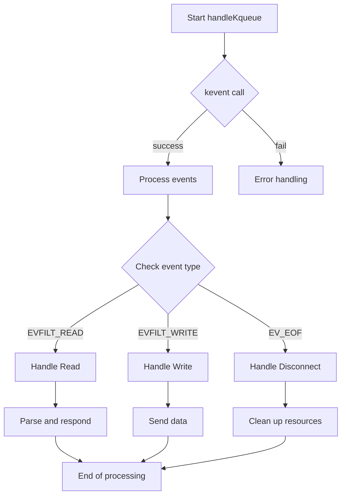
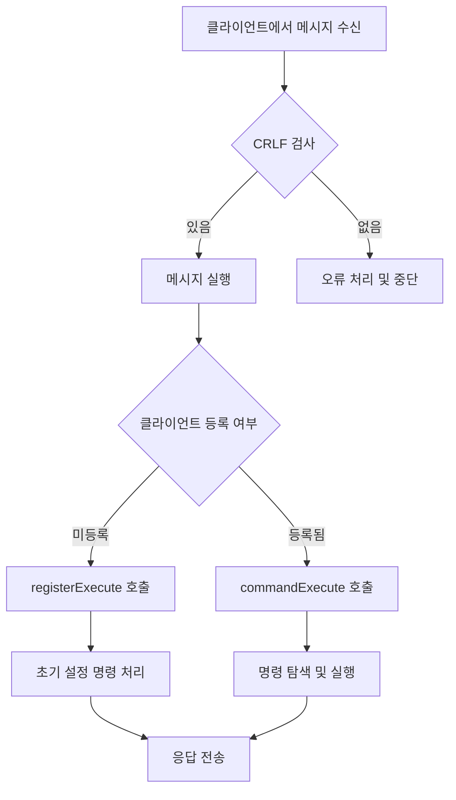

```mermaid
graph TD;
    A[Client Constructor] -->|initialize| B[setRecvFd]
    A -->|initialize| C[setPassword]
    A -->|initialize| D[setNick]
    A -->|initialize| E[setUsername]
    A -->|initialize| F[setHostname]
    A -->|initialize| G[setRealname]
    A -->|initialize| H[setRecvData]
    A -->|initialize| I[setSendMsg]
    A -->|initialize| J[setWriteTypes]
    A -->|initialize| K[setRegistered]
    A -->|initialize| L[setCurChannel]
    A -->|initialize| M[setRegisterFlags]
    A -->|initialize| N[setLeaveMsg]
    B --> O[getrecvfd]
    C --> P[getPassword]
    D --> Q[getNick]
    E --> R[getUser]
    F --> S[getHostname]
    G --> T[getRealname]
    H --> U[getRecvData]
    I --> V[getSendMsg]
    J --> W[getWriteTypes]
    K --> X[getRegisterd]
    L --> Y[getCurChannel]
    M --> Z[getIsRegisterFlags]
    N --> AA[getLeaveMsg]
    AB(startListen) --> AC[Accept Connection]
    AC --> F
    AC --> AD[Set Non-Blocking]
    AE(startParseMessage) --> AF[Parse Message]
    AF --> AG[Clear m_recv_data]
    AF --> AH[Execute Command]
    AI(startResponse) --> AJ[Generate Response]
    AK(startSend) --> AL[Send m_send_msg]
    AL --> AM[Clear m_send_msg]
    AN(addSendMsg) --> AO[Append to m_send_msg]
```

# FT_IRC

FT_IRC는 IRC(Internet Relay Chat) 서버 구현 프로젝트입니다. 이 프로젝트는 네트워크 프로그래밍의 기본을 학습하고, 실시간 텍스트 기반 통신 시스템을 구축하는 것을 목표로 합니다. FT_IRC는 사용자가 채널을 생성하고, 메시지를 교환하며, 다양한 IRC 명령어를 사용할 수 있는 환경을 제공합니다.

기술 스택
- 프로그래밍 언어: C++
- 네트워크 라이브러리: POSIX sockets
- 테스트 프레임워크: irssi, nc
- 기타 도구: Make, Docker, codespace

### 설치 및 실행 방법
1. 소스 코드 클론:
```bash
git clone https://github.com/ByteTalkers/FT_IRC.git
```
2. 컴파일
```bash
make -j
```
3. 서버 실행
``` bash
./ircserv <port> <password>
```
4. 클라이언트 연결 (별도의 IRC 클라이언트 사용 ex, irssi):
```bash
irssi
```

### 사용 예제
1. 서버에 연결
```bash
/connect -nocap <client_ip> <port> <password> <nick>
```
2. 채널 가입
```bash
/join <your_nickname>
```
3. 메시지 전송
```bash
/privmsg <channel_name> <message>
```
4. 채널 나가기
```bash
/part <channel_name>
```
5. 모드 기능
- i : invite 모드
- t : topic 모드
- k : key 모드
- o : operator 모드
- l : 채널 제한 인원 모드
모드 앞에 +가 붙으면 모드 활성화, -면 모드 비활성화
6. 토픽 설정
```bash
/topic <channel_name> <topic topics>
```
7. 강퇴 기능
```bash
/kick <channel_name> <target_client>
```
8. 종료 기능
```bash
/quit <reason>
```
### Server 함수 흐름도


### Client 함수 흐름도


### Message 함수 흐름도

